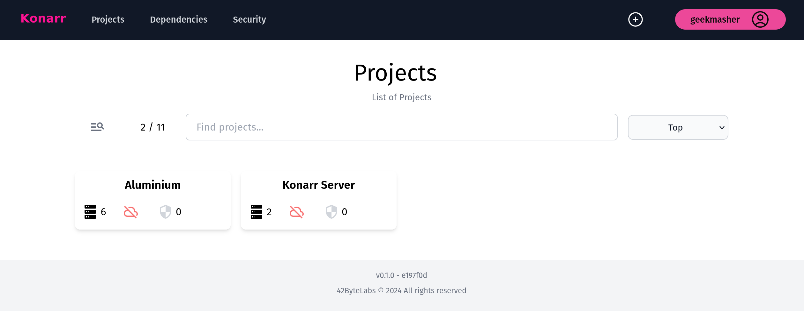
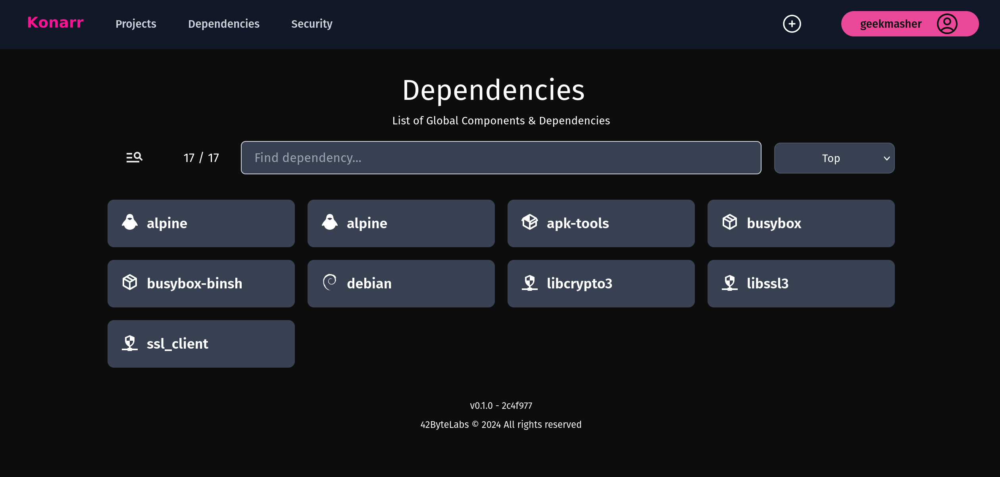
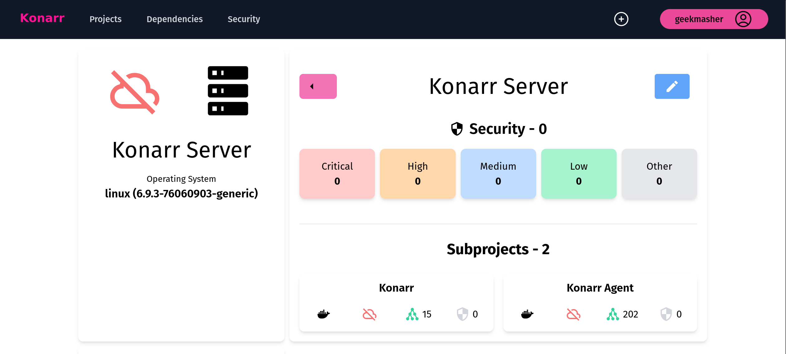
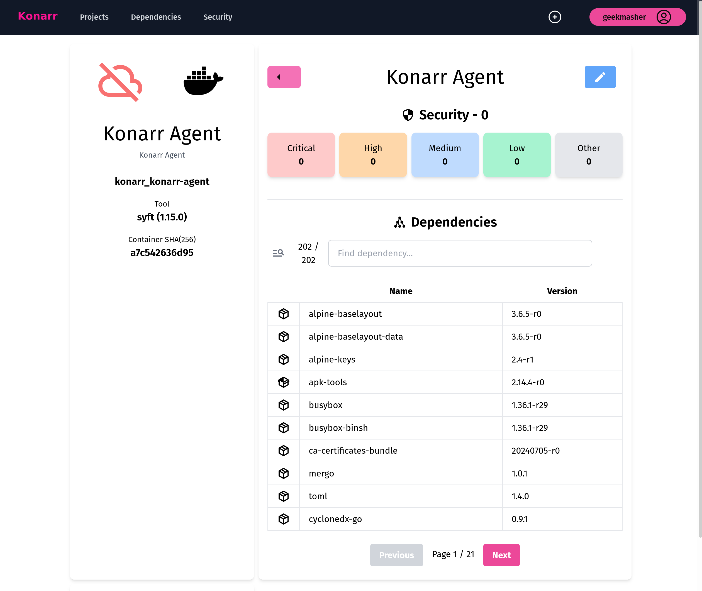
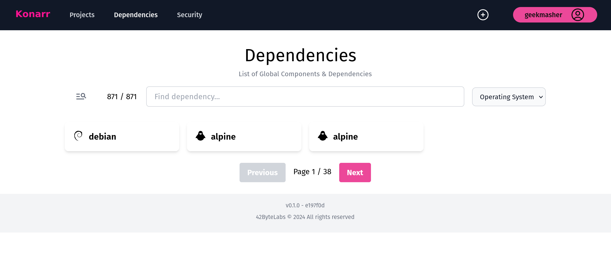

<!-- markdownlint-disable -->
<div align="center">
<h1>Konarr</h1>


[][github]
[][crates-io]
[][crates-io]
[][docs]
[][github]
[][github-issues]
[][license]

⚠️  Work in progress and early stages of development ⚠️

</div>
<!-- markdownlint-restore -->

## Overview

[Konarr][konarr] is a simple, easy-to-use web interface for monitoring your servers, clusters, and containers supply chain for dependencies and vulnerabilities.
It is designed to be lightweight and fast, with minimal resource usage. 

It is written in [Rust][rust-lang], uses [Rocker][rocket] for the web server, and [Vue.js](https://vuejs.org/) for the front-end.

<details>
<summary><strong>Origin Story</strong></summary>

This project came out of the need to monitor my homelab for insecure dependencies / components.
All the products that offer this are proprietary and cost money to use.

[In December 2021, Log4Shell (CVE-2021-44228)](https://en.wikipedia.org/wiki/Log4Shell) came dropped and like most of the world I was running around trying to find if I had a service using it.
Turned out I was but it was a painful process in finding if I was even using it.

**Name Origin:**

Konarr is from the name [Konar quo Maten](https://oldschool.runescape.wiki/w/Konar_quo_Maten) (translated as Konar the Hunter) from the game [Old School Runescape](https://oldschool.runescape.com/).

</details>

## 🖼️ Screenshots

<div align="center">





<details>
<summary>More screenshots</summary>

**Single Project Summary** 


**Container Summary**


**Dependencies View**


</details>

</div>

## ✨ Features

- Simple, easy-to-use web interface
- Blazing fast performance with minimal resource usage (written in [Rust][rust-lang] 🦀)
- Real-time monitoring of your containers
  - Uses [Syft][syft] for image scanning (with more scanners to come)
- Orchestration support
  - Docker / Podman
  - Docker Compose / Docker Swarm
  - 🚧 Kubernetes support is planned
- Software Bill of Materials (SBOM) for your containers
- 🚧 Supply chain attack monitoring

## 🚀 Quick Start

This small script will install the Konarr server and agent on your machine using containers.

```bash
curl https://raw.githubusercontent.com/42ByteLabs/konarr/refs/heads/main/install.sh | bash -s
```

## 📚 Documentation

<div align="center">
🚧 Work in progress 🚧
</div>

## 🛠️ Installation

Konarr can be installed using Docker, Podman, or Cargo (native).

### Konarr using Compose

When using Docker/Podman Compose, the Konarr server and agent will be installed on your machine using containers.

<details>
<summary>Cloning the repository</summary>

```bash
# Clone the Konarr repository from GitHub
git clone https://github.com/42ByteLabs/konarr.git && cd konarr
# Update submodules
git submodule update --init --recursive
```

</details>

**Starting the server and agent:**

```bash
docker-compose up -d
```

### 💻 Konarr Server

The Konarr Server is the API and web interface that is used to monitor your containers.
It can be installed using Docker/Podman or Cargo (native).

#### Konarr Server using Docker

```bash
docker run -it --rm \
    -p 9000:9000 \
    -v ./data:/data \
    -v ./config:/config \
    ghcr.io/42bytelabs/konarr:v0.3.1
```

<details>
<summary>Description</summary>

This command does the following:

- `-it --rm` - This is a common set of flags to pass to `docker run`. The `-it` flag is short for `--interactive` and `--tty`, which tells Docker to open an interactive terminal inside the container. The `--rm` flag tells Docker to automatically remove the container when it stops running.
- `-p 9000:9000` - This tells Docker to map port 9000 on the host machine to port 9000 on the container. This is the port that the Konarr server listens on by default.
- `-v ./data:/data` - This tells Docker to mount the `./data` directory on the host machine to the `/data` directory on the container. This is where Konarr stores its data by default.
- `-v ./config:/config` - This tells Docker to mount the `./config` directory on the host machine to the `/config` directory on the container. This is where Konarr looks for its configuration file by default.
- `ghcr.io/42bytelabs/konarr:v0.3.1` - This is the name of the Docker image that we want to run. The `ghcr.io/42bytelabs/konarr` part is the name of the repository on GitHub Container Registry, and the `v0.1.0` part is the tag of the image that we want to run.

</details>

#### Install Server via Cargo

The `konarr-server` can be installed using Cargo but it is not recommended for production use.

```bash
cargo install konarr-server
```

### 🕵️ Konarr Agent

The Konarr Agent is the Konarr CLI that is used to monitor your containers.
It is written in Rust and is available as a binary or as a Docker image.

#### Running Agent in Docker

```bash
docker run -it --rm \
    -e KONARR_INSTANCE \
    -e KONARR_AGENT_TOKEN \
    -e KONARR_PROJECT_ID \
    ghcr.io/42bytelabs/konarr-agent:v0.3.1
```

#### Install Agent via Cargo

The konarr-cli is a Rust binary that can be installed via Cargo.

```bash
cargo install konarr-cli
```

### From Source

```bash
# Clone the Konarr repository from GitHub
git clone https://github.com/42ByteLabs/konarr.git && cd konarr
# Update submodules (client/frontend is a submodule)
git submodule update --init --recursive

# Build frontend
cd client && npm install && npm run build && cd ..
# Build and run server
cargo run -p konarr-server --release -- -c ./konarr.yml
```

## ❤️  Maintainers / Contributors

<!-- ALL-CONTRIBUTORS-LIST:START - Do not remove or modify this section -->
<!-- prettier-ignore-start -->
<!-- markdownlint-disable -->
<table>
  <tbody>
    <tr>
      <td align="center" valign="top" width="14.28%"><a href="https://geekmasher.dev"><br /><sub><b>Mathew Payne</b></sub></a><br /><a href="#code-GeekMasher" title="Code">💻</a> <a href="#review-GeekMasher" title="Reviewed Pull Requests">👀</a></td>
    </tr>
  </tbody>
</table>

<!-- markdownlint-restore -->
<!-- prettier-ignore-end -->

<!-- ALL-CONTRIBUTORS-LIST:END -->

## 🦸 Support

Please create [GitHub Issues][github-issues] if there are bugs or feature requests.

This project uses [Semantic Versioning (v2)][semver] and with major releases, breaking changes will occur.

## 📓 License

This project is licensed under the terms of the Apache2 open source license.
Please refer to [Apache2][license] for the full terms.

<!-- Resources -->

[license]: ./LICENSE
[crates-io]: https://crates.io/crates/konarr
[docs]: https://docs.rs/konarr/latest/konarr
[semver]: https://semver.org/
[rust-lang]: https://www.rust-lang.org/
[rocket]: https://rocket.rs/

[konarr]: https://github.com/42ByteLabs/konarr
[github]: https://github.com/42ByteLabs/konarr
[github-issues]: https://github.com/42ByteLabs/konarr/issues

[syft]: https://github.com/anchore/syft

